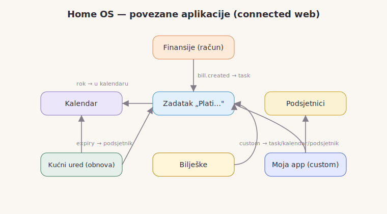

# Home OS — Uputstvo za upotrebu

Home OS je „operativni sistem za kuću": jedno mjesto za sve što domaćinstvo
treba — zadatke, ploče, kalendar, podsjetnike, bilješke, finansije i kućne
zapise — dijeljeno između ukućana, uz e-mail obavijesti. Sve je **povezano**:
račun napravi zadatak, zadatak s rokom se pojavi na kalendaru, obnova pokrene
podsjetnik.

> Slike u ovom uputstvu: ubaci svoje snimke ekrana u `docs/screenshots/`
> (imena su navedena u `docs/screenshots/README.md`). Dok ih nema, prikazuje se
> dijagram veza ispod.

---

## 1. Prvo pokretanje

1. Pokreni SQL migracije u Supabase (SQL Editor), redom:
   `0001` … `0006`. Bez `0005` i `0006` neće raditi Finansije/Bilješke/Kućni
   ured ni upravljanje aplikacijama.
2. Popuni `.env.local` (vidi `README.md`) i `npm install && npm run dev`.
3. Registruj se → napravi domaćinstvo (postaješ **administrator**).
4. Pozovi ukućane u **Članovi**.

---

## 2. Navigacija

Meni prati redoslijed iz zadatka: **Danas, Zadaci, Kanban, Kalendar,
Podsjetnici, Bilješke, Finansije, Kućni ured, Članovi, Postavke.** Ono što
sam sakriješ ili što admin učini nedostupnim — ne prikazuje se.

---

## 3. Aplikacije ukratko

**Danas (Dashboard).** Skuplja ono što je bitno sada: dospjeli zadaci, današnji
događaji, računi koji dolaze, aktivni podsjetnici. Ima **pretragu preko svega**
i **brzo unošenje** (zadatak/bilješka/podsjetnik) bez kopanja po menijima.

**Zadaci.** Rokovi, prioriteti, odgovorna osoba, tagovi, ponavljanje; označavanje
gotovog i pregled zakašnjelog.

**Kanban.** Više ploča (npr. Kuća, Posao). Prevuci karticu među kolonama
*Za uraditi → U toku → Gotovo*. Ispusti je iznad kolone u koju je želiš — cilja
se tamo gdje je kursor.

**Kalendar.** Pregled **mjesec / sedmica / dan**. Zadaci s rokom se **automatski**
pojave na svoj datum; svi dijeljeni događaji domaćinstva su u istom pogledu.

**Podsjetnici.** Jednokratni i ponavljajući, **usmjereni na određenog člana**.
Kad dospiju, cron ih pošalje e-mailom (ako je kategorija uključena). Mogu se
kreirati i iz drugih app-ova (npr. obnova iz Kućnog ureda).

**Bilješke.** Bilješke s tagovima, poseban **Dnevnik**, i **povezivanje** bilješke
na postojeći zadatak/račun/događaj.

**Finansije.** Prihodi i rashodi po kategoriji, **mjesečni budžeti** s progresom,
računi i pretplate s rokom, mjesečni sažetak (prihod/rashod/neto) i pregled
**„ko je platio / ko duguje"**. Dodavanjem računa automatski nastaje povezani
zadatak „Plati…".

**Kućni ured (Life admin).** Dokumenti, garancije, obnove, kontakti; **rok obnove
automatski kreira podsjetnik** 7 dana ranije (koristi postojeći app Podsjetnici).
Plus dijeljene liste za kupovinu.

---

## 4. Dijeljenje i članovi

- Svako u domu se dodaje kao **član** (Članovi → pozovi e-mailom).
- Kod većine unosa biraš **vidljivost**: *Samo ja* (privatno) ili *Cijelo
  domaćinstvo*. Bazna pravila privatnosti provodi sama baza (RLS).
- Zadaci i podsjetnici se **dodjeljuju članu** — vidi se ko je odgovoran.
- Promjena jednog člana odmah je vidljiva svima.

---

## 5. Upravljanje aplikacijama (Postavke)

- **Sakrij / Prikaži (za mene):** svako sebi uredi navigaciju — ostavi samo ono
  što koristi.
- **Dostupno / Nedostupno (admin):** administrator uključuje ili isključuje app
  za **cijelo domaćinstvo**. Nedostupan app nestaje svima.
- **E-mail obavijesti:** svaki član sam bira koje kategorije prima (podsjetnici,
  dodijeljeni zadaci, dospjeli računi, dnevni sažetak) — lako uključi/isključi.

---

## 6. Napravi vlastitu aplikaciju

Postavke → **„Napravi novu aplikaciju"**. Upiši naziv (npr. *Teretana*), kratak
opis i kako se zove stavka (npr. *trening*), pa odaberi s čime se **povezuje**:

- **Zadaci** — svaka stavka pravi povezani zadatak.
- **Kalendar** — stavka s datumom se upiše u kalendar.
- **Podsjetnici** — zakaže se podsjetnik dan ranije.

Nova app se **odmah** pojavi u navigaciji, na „Danas" i u pretrazi, i **koristi
postojeće app-ove** umjesto da gradi svoje — tačno kako platforma i traži.
Otvara se na `/x/<naziv>`. Administrator/kreator je može i obrisati (čisto,
bez ostataka).

---

## 7. Kako su stvari povezane (primjeri)

- Dodaš **račun** u Finansijama → nastane **zadatak** „Plati…" (i link među njima).
- **Zadatak s rokom** → automatski se vidi u **Kalendaru**.
- **Obnova** u Kućnom uredu s datumom isteka → **podsjetnik** 7 dana ranije.
- Stavka u **tvojoj app-i** (ako je tako podešena) → zadatak / događaj / podsjetnik.

Sve to ide preko zajedničkog *event busa* i `links` tabele, pa aplikacije
sarađuju bez direktne međuovisnosti.
